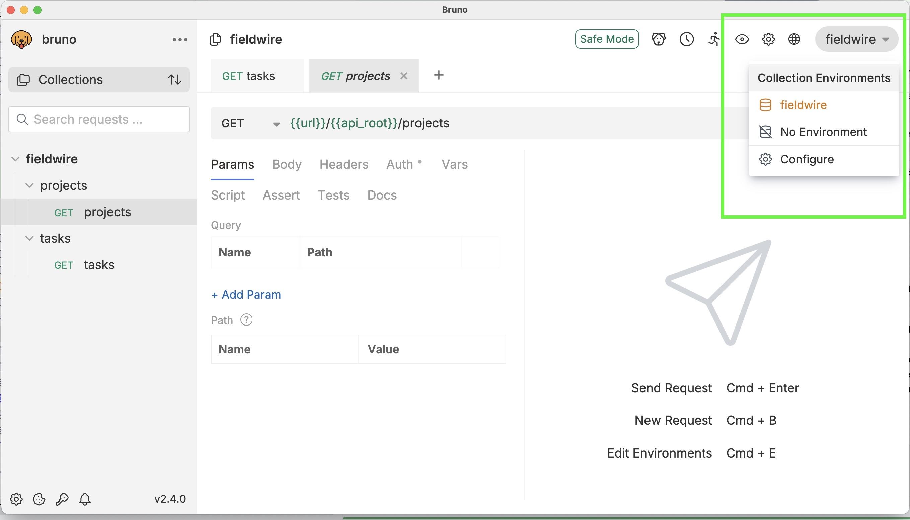
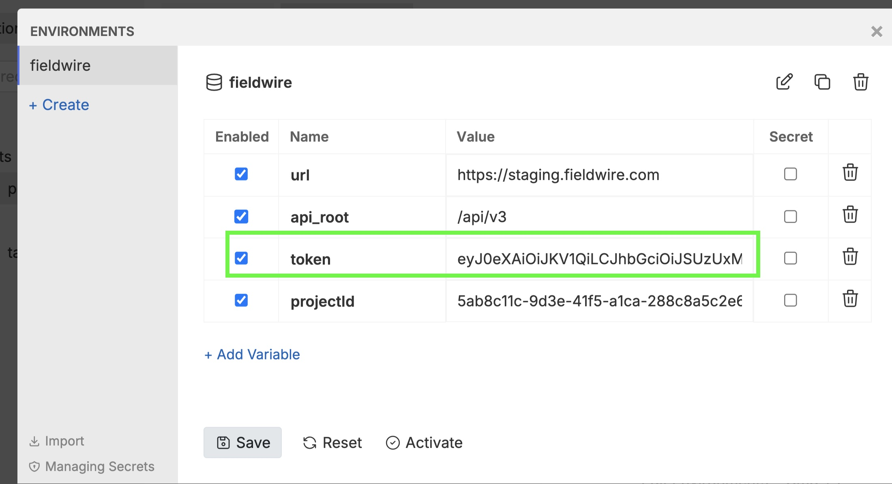
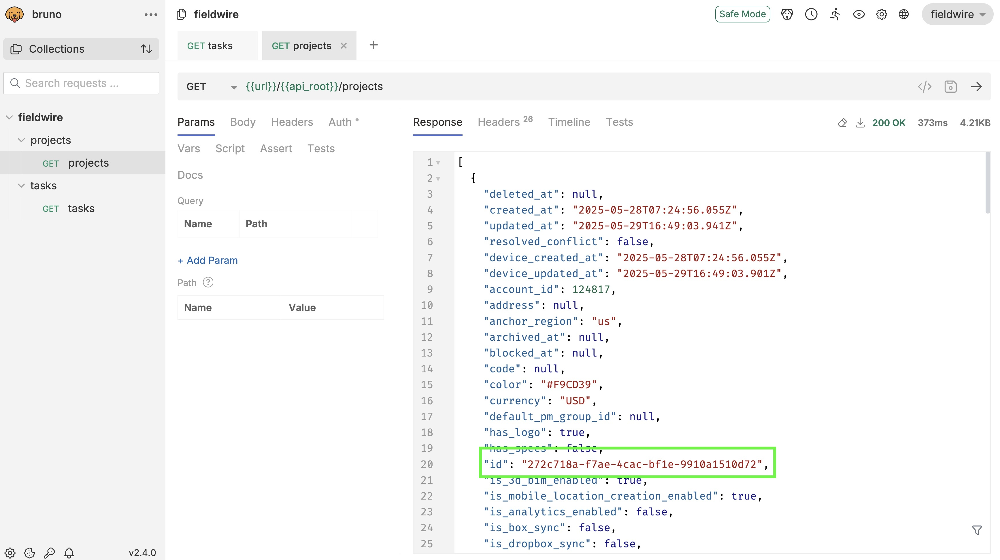

# Fieldwire Take-home Automation Challenge

I focused this project more on setting up a solid foundation than on writing 
a lot of tests. The goal was to build something that could grow into a much 
larger automation suite. I spent more of my time designing the structure, 
wiring things together, and making sure the pieces are easy to expand later. 
There are a few tests in place, but the emphasis here is really on the 
framework itself. This is also my first introduction to Playwright, and I'm 
very impressed with its capabilities.

This project implements an automated E2E test framework using Playwright.It tests basic workflows in the Fieldwire application, including login, task creation, form interaction, and layout validation across viewports.

The project is organized as a TypeScript modular structure, with reusable code in libraries under ./libs and tests under ./apps/fieldwire-tests.

## Setup

Install dependencies:

```bash
npm install
```

Set the following variables in a `.env` file:

```
FIELDWIRE_EMAIL=test@example.com (replace with actual)
FIELDWIRE_PASSWORD=test-password (replace with actual)
FIELDWIRE_ENV_PROJECT=Takehome   (use this for running tests).
```

> Note: this file is excluded from source control to protect secrets. In CI, its contents are injected using a GitHub secret named `FIELDWIRE_ENV` and written to disk before tests are run.

## Run Tests

```bash
npm run e2e
```

## Run Unit Tests

```bash
npm run test:libs:unit
```
The libraries under ./libs are designed to be independent of the test runner and UI framework logic. This separation makes them suitable for unit testing with mocking and dependency injection. While the current implementation includes only placeholder unit tests due to time constraints, the structure supports isolated testing of API helpers, utilities, and page logic in future iterations.

## Lint

```bash
npm run lint:all
```

## Project Layout

```
.
├── apps/
│   └── fieldwire-tests/
│       ├── tests/
│       └── tsconfig.json
├── bruno/                      # Bruno API collection for testing REST endpoints
├── libs/
│   ├── api/
│   ├── helpers/
│   ├── page-objects/
│   └── test-data/
├── .github/
│   └── workflows/
│       └── ci.yml
├── .env                        # Environment credentials (excluded from git)
├── .eslintrc.js
├── playwright.config.ts
├── package.json
├── tsconfig.base.json
└── ARCHITECTURE.md
```

## Available Scripts

The following npm scripts are defined to support testing and linting workflows:

| Script                      | Description                                                  |
|-----------------------------|--------------------------------------------------------------|
| `npm run e2e`               | Runs all Playwright end-to-end tests using `.env` credentials |
| `npm run test:libs:unit`    | Runs all Jest unit tests in the `libs/` directory             |
| `npm run lint:test`         | Lints the E2E test files under `apps/fieldwire-tests/`        |
| `npm run lint:api`          | Lints reusable API client code under `libs/api/`              |
| `npm run lint:helpers`      | Lints utility functions under `libs/helpers/`                 |
| `npm run lint:page-objects` | Lints Page Object Model classes in `libs/page-objects/`    |
| `npm run lint:all`          | Lints all the projects |


## Bruno collection

I created a small Bruno collection to experiment with the API.  To use it:

1. Install Bruno (https://www.usebruno.com)
2. Import the collection from /keithleffler-fw-takehome/bruno
3. Get the current accessToken
   4. Search for the element with 
         "name":"accessToken" in user.json
   5. Copy the token in the "value":<token> of the record (next line).  This 
      assumes an un-expired token.  Run some tests in Playwright to ensure a 
      valid token
   6. Paste the token into the "token" variable in the Bruno enviorment.
   7. Save the environment
   8. Run the request:







## Design Notes

See [ARCHITECTURE.md](./ARCHITECTURE.md) for additional details, including CI limitations, design tradeoffs, and commentary on future improvements.

- The tests use a pre-configured project 'Takehome'.  An API call is used to 
  retrieve the project id value.  In a production test environment, a test 
  suite should either create and delete new projects for each test run to 
  limit the number of projects in the test environment.  This would involve 
  a lot of setup or database seeding.  Because of time constraints, I 
  decided to use a pre-configured project instead of writing the Playwright 
  code to create a project via the UI.
- Viewport-specific smoke tests (apps/fieldwire-tests/tests/smoke_test.spec.
  ts) are skipped unless the browser context is 
  Chromium.
- Static JSON is used for test data to simplify setup. In production, this could be replaced with dynamic or API-fetched data.
- The test framework avoids full monorepo overhead but uses a modular layout for future scalability.
